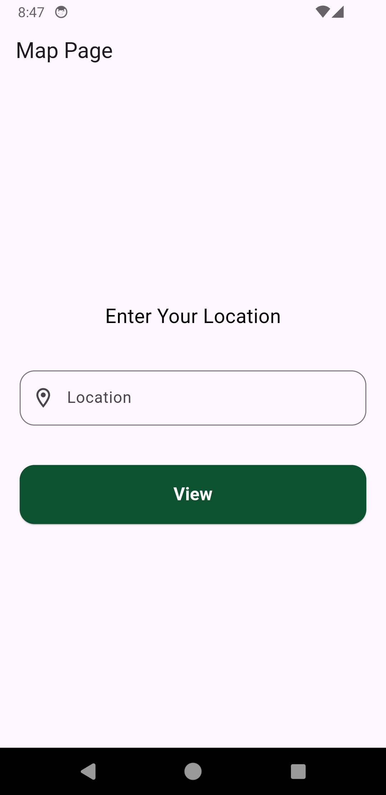
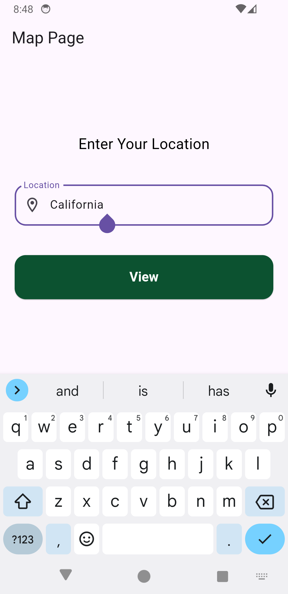
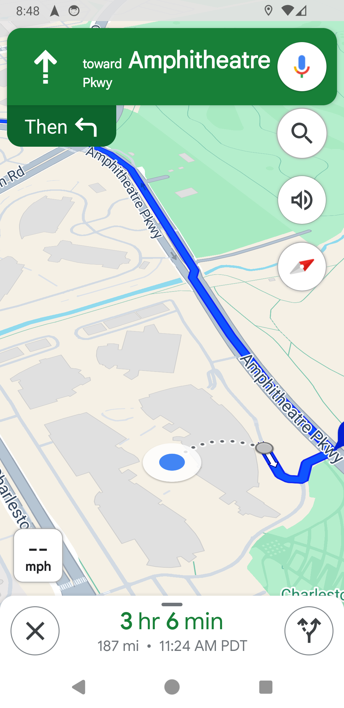

# flutter_open_google_map

# 🌍 Navigate to Google map App

flutter_open_google_map is a simple and powerful Flutter app that allows users to open Google Maps with a given destination using text input. Whether you're looking to navigate to a specific place or just explore a new location, this app has you covered!


---

## 📱 Features

- 🗺 **Enter Destination**: Input any location and open Google Maps with that destination.
- 🌐 **Google Maps Integration**: Directly launch Google Maps with a destination using latitude and longitude coordinates.
- 🚀 **Cross-Platform**: Works on both Android and iOS devices.
- 🔍 **Search Friendly**: Utilizes geocoding to convert addresses into coordinates for precise navigation.

---

## 📸 Screenshots

| Home Screen | Input Destination | Google Maps |
|-------------|-------------------|-------------|
|  |  |  |

---

## 🚀 Quick Start

### Prerequisites

Before you start, make sure you have the following installed:

- [Flutter SDK](https://flutter.dev/docs/get-started/install)
- A physical device or emulator with **Google Maps** installed (if testing on Android)

### Installation

1. **Clone the repository:**
   ```bash
   git clone https://github.com/sahas97/flutter_open_google_map.git
2. **Create new folder and open it with VS-code:**
   
3. **Open the the Vs-code terminal and navigate to folder:**
   ```bash
   cd flutter_open_google_map

4. **Then run following command to install dependencies:**
    ```bash
    flutter pub get
5. **Run the app**:

   **For Android:**
   ```bash
   flutter run
   ```
   **For iOS:**
   ```bash
   flutter run --ios
## 🛠 Folder Structure
### The project is organized as follows:

```markdown
lib/
│
├── main.dart                # Entry point of the app
├── screens/                 # UI screens
│   └── map_screen.dart      # Map screen where user inputs location
├── models/                  # Data models
│   └── lat_lng.dart         # Model class for LatLng
├── utils/                   # Utility functions and helpers
│   └── map_launcher.dart    # Handles launching Google Maps
│   └── error_handler.dart   # Centralized error handling
└── widgets/                  # Reusable UI components (if you needed separate widgets. I didn't separte that for easy understanding.)

```

## 🌍 Usage
1. **Enter Location**: On the main screen, enter a location or address.
2. **Open Google Maps**: Press the "View" button to launch Google Maps with the provided location.
3. **Navigate**: Google Maps will automatically open and display the destination.

## 🧰 Technologies & Packages
- **Flutter**: Flutter is used to build the UI and handle interactions.
- **Dart**: The core language of Flutter apps.
- **url_launcher**: Used to launch the Google Maps app.
- **geocoding**: Converts address text into geographic coordinates (latitude and longitude).

## 🛠 Code Examples
**Here’s a sample of the core functionality for launching Google Maps**:
```dart
class MapLuancher {
  MapLuancher._();

  static Future<LatLng?> getDestinationCoordinates(String address) async {
    try {
      List<Location> locations = await locationFromAddress(address);
      if (locations.isNotEmpty) {
        return LatLng(locations[0].latitude, locations[0].longitude);
      }
    } catch (e) {
      log('Error getting destination coordinates: $e');
    }
    return null;
  }

  static Future<void> launchGoogleMaps(LatLng? destinationLocation) async {
    if (destinationLocation == null) {
      log('Destination location is null');
      return;
    }

    final uri = Uri(
      scheme: "google.navigation",
      queryParameters: {
        'q': '${destinationLocation.latitude}, ${destinationLocation.longitude}'
      },
    );
    if (await canLaunchUrl(uri)) {
      await launchUrl(uri);
    } else {
      log('Unable to open Google Maps.');
    }
  }
}

```

## 📚 How It Works
1. The user enters an address or location in the provided text field.
2. The app converts this address into coordinates using the geocoding package.
3. Using url_launcher, the app opens Google Maps with the coordinates.
3. If the process succeeds, Google Maps shows the desired destination.

## 🐛 Issues
If you encounter any issues, please feel free to open a GitHub Issue. We welcome contributions and feedback!

# So enjoy guys 🥂 ❤️❤️❤.
